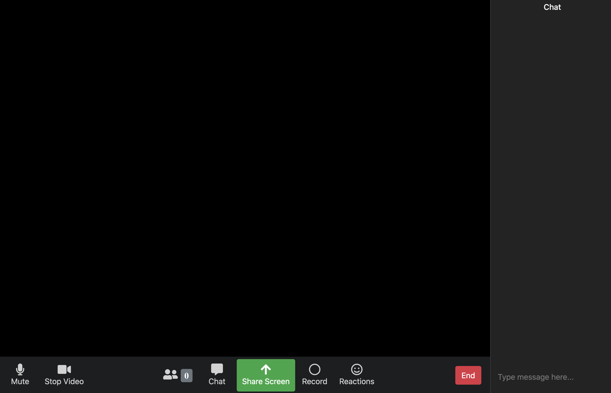

# Projeto base da JS Expert Week 2.0

- Acesse o [home](./pages/home/index.html) para acessar a home page
- Acesse o [room](./page/room/index.html) uma room específica

## Home Page

## Room

### Créditos

- Layout da home foi baseada no codepen do [Nelson Adonis Hernandez
](https://codepen.io/nelsonher019/pen/eYZBqOm)
- Layout da room foi adaptado a partir do repo do canal [CleverProgrammers](https://github.com/CleverProgrammers/nodejs-zoom-clone/blob/master/views/room.ejs)

### INFORMACOES E PASSOS REALIZADOS APOS CLONE:
- cmd: "npm ci --silent" 
-webRTC - web real time communication - proporcionar comunicacao em tempo real de audio e video entre web browser e app mobiles - comunicacao p2p (peer-to-peer - direta entre usuarios do sist)

- no proj 'peer-server', fazer 'npm i peer@0.6.1' - o nosso html vai tem q se comunicar c esse projeto p gerar os identificadores peer to peer